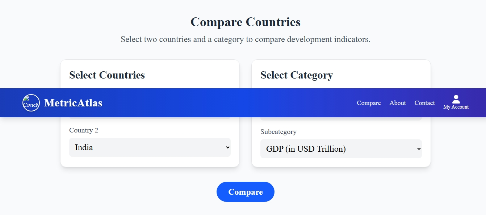

# [MetricAtlas]
*Submitted by: [Sakshi]*

## 🌟 Live Demo  
🔗 **[View Live Demo](https://web-development-projects-2jis.vercel.app/)**

## 📸 Screenshots

## 🛠️ Tech Stack
- Frontend: [e.g., React, Vue.js, Angular]
- Backend: [if applicable]
- Database: [if used]
- Visualization: [e.g., D3.js, Chart.js, Plotly]
- Deployment: [e.g., Vercel, Netlify, Heroku]

## ✨ Unique Features
- **[Feature 1]**: Brief description of what makes it special
- **[Feature 2]**: How it enhances user experience
- **[Feature 3]**: Technical innovation implemented
