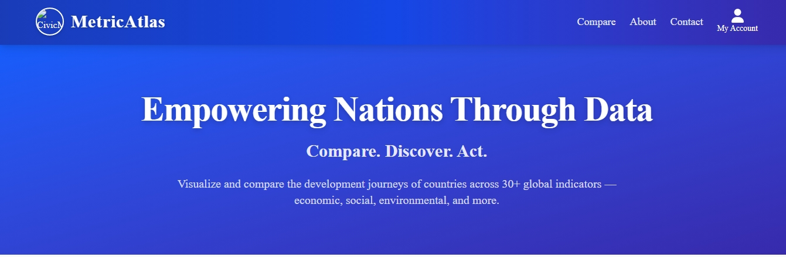
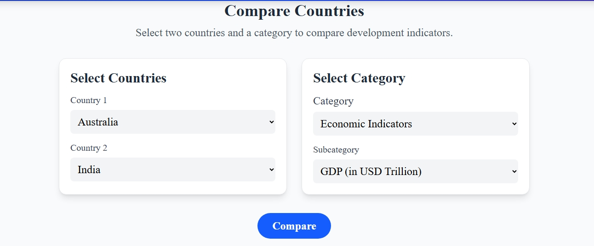
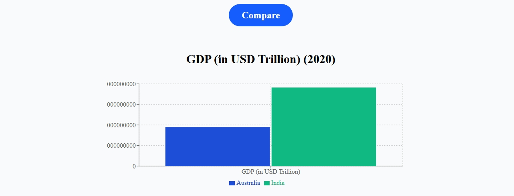
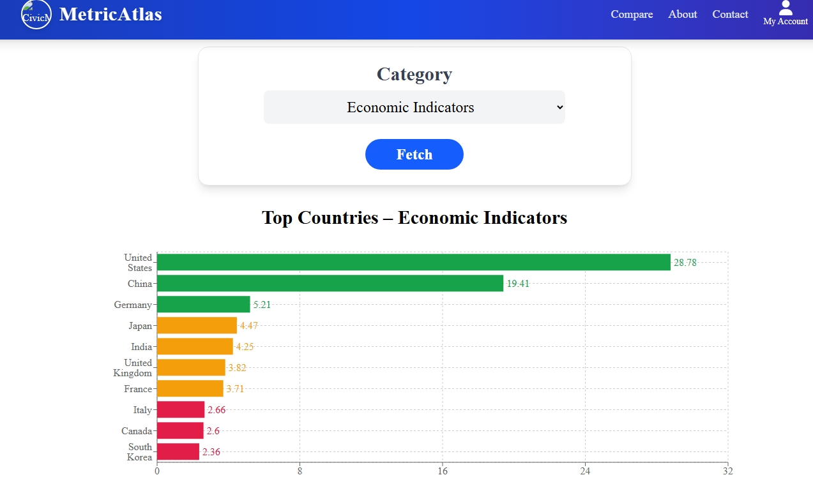

# [MetricAtlas]
*Submitted by: [Sakshi]*

## 🌟 Live Demo  
🔗 **[View Live Demo](https://web-development-projects-2jis.vercel.app/)**

## 📸 Screenshots

## 🛠️ Tech Stack
- Frontend: [React, TailwindCss]
- Visualization: [Recharts]
- Deployment: [Vercel]
  
## ✨ Unique Features
- **Dynamic Country & Category Selection**: Users can interactively choose countries and development categories to view tailored comparisons.
- **Clean, Responsive UI**: A modern and intuitive interface ensures smooth navigation across devices, improving user engagement and accessibility.
- **Real-Time Data Visualization**: Utilizes Recharts for interactive and responsive bar charts, enabling clear insights through visual data comparisons.

